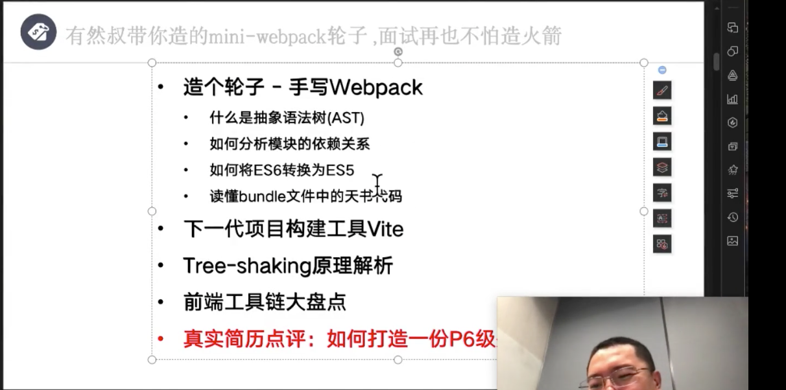

## 手写 webpack
> webpack 将用模块化工具写出的代码打包在一起

### 模拟 commonJs 进行编写代码
```
├── README.md
└── src
    ├── add.js
    ├── img.png
    ├── index.html
    └── index.js
```

#### <font color="red">Uncaught ReferenceError: require is not defined</font>
```javascript
// add.js
exports.default = function (a, b) { return a + b; }
// index.js
var add = require('add.js').default
```
```html
<script src="index.js"></script>
```
> require 方法没有定义

1. 读取文件
2. webpack 是把读取文件拼成一个新文件  bundle.js
3. 使用 eval 或 new function 方法运行读取的字符串

### 1.模拟 commonJS 模块导出
```javascript
// 1. 读取的文件为字符串，使用 eval 运行字符串
var exports = {}
eval('exports.default=function (a,b) {return a+b;}')
console.log(exports.default(1,2))
```

### 2. 使用自执行函数避免`eval`执行过程中定义的变量绑定到全局造成变量污染
```javascript
var exports = {}
(function(exports,code){
    eval(code)
})(exports, 'exports.default=function(a,b){return a+b}')
console.log(exports.default(1,3))
```

### 3.模拟 require 导入模块，迷你 webpack
```javascript
(function(list){
    function require(file) {
        var exports = {};
        (function(exports, code) {
            eval(code)
        })(exports, list[file])
        return exports
    }
    require('index.js')
})({
    'index.js': `var add = require('add.js').default; console.log(add(2,3))`,
    'add.js': `exports.default = function(a,b){return a+b}`
})
```

### ES6 Modules 实现
#### 1. 代码改造
```
// add.js
export default (a,b) => a + b
// index.js
import add from 'add.js'
add(2,3)
```
#### 环境配置
> babel 全家桶
@babel/core
@babel/preset-env
@babel/traverse
@babel/parser
